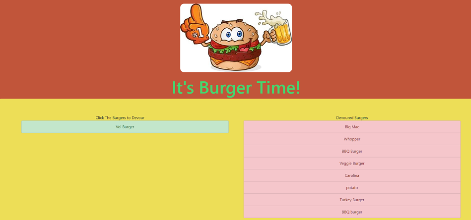

# burger

deployed here [https://salty-mountain-52089.herokuapp.com/](https://salty-mountain-52089.herokuapp.com/)

***

This project uses the following technologies:
  * handlebars
  * Express
  * node.js
  * MySQL
  
It was built using:
  * MVC 
  * custom ORM
  
*** 

Add a burger to the list using the form. 

Click a burger to eat it (move it to the 'devoured' column)

